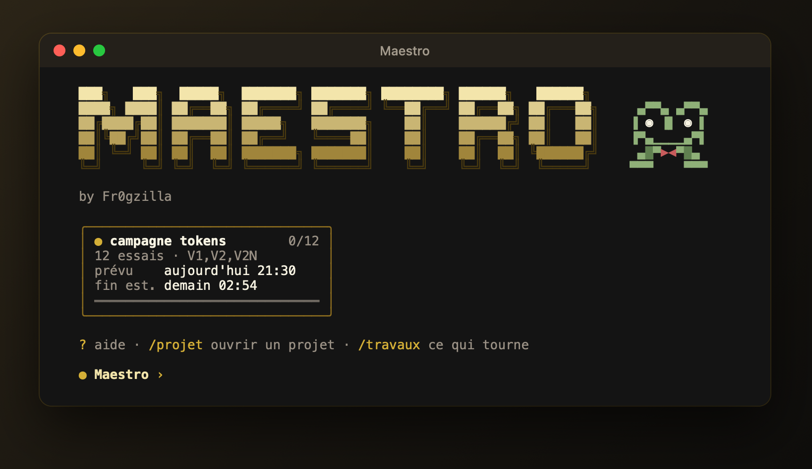
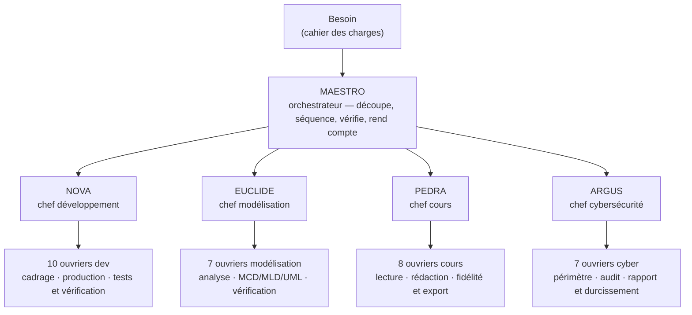
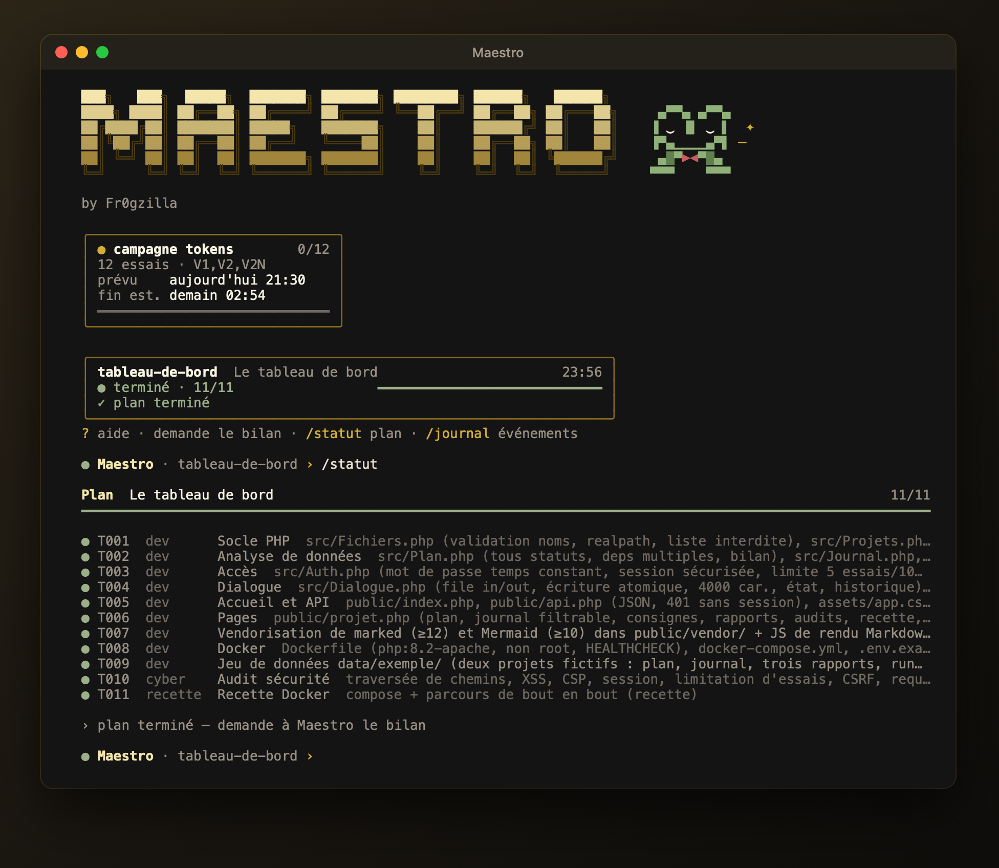
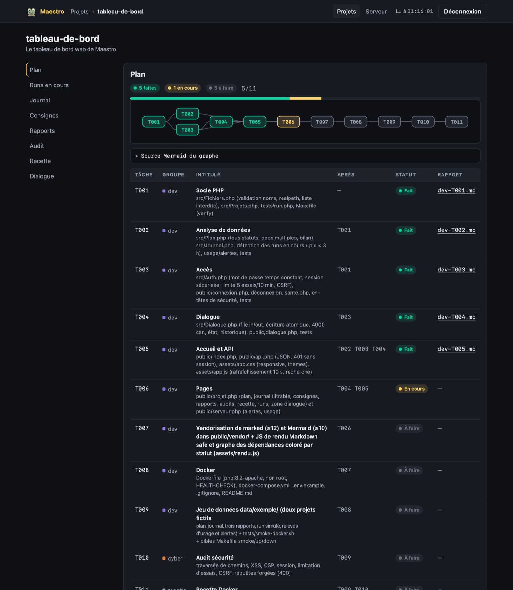
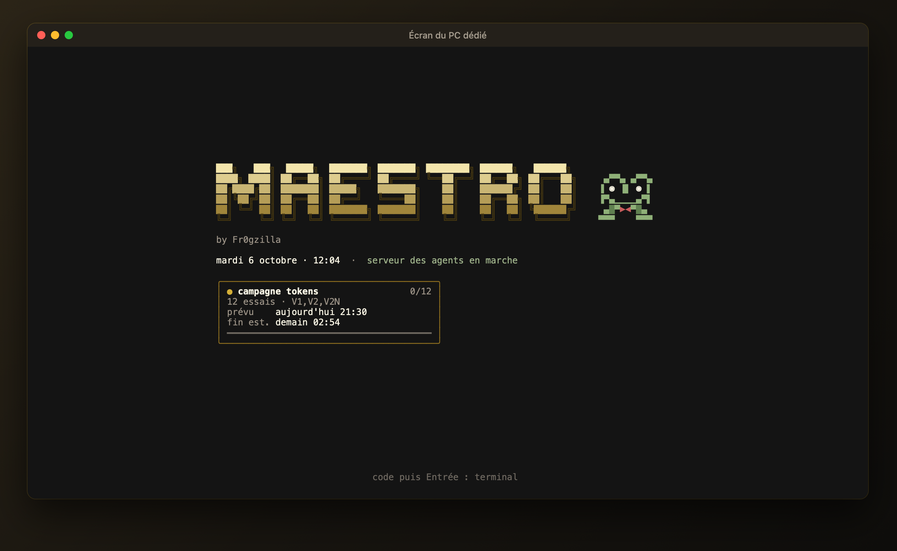
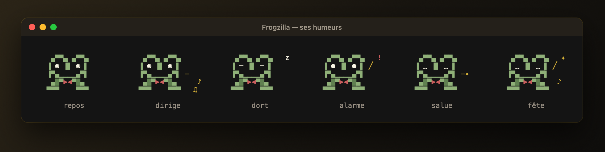

  

<h1 align="center">Maestro</h1>

  <strong>Un orchestrateur d'agents IA qui mène un projet de bout en bout — du cahier des charges au livrable testé — 
  sur un serveur dédié, de jour comme de nuit.</strong>

  <a href="docs/01-besoin.md">Le besoin</a> ·
  <a href="docs/02-reflexion.md">La réflexion</a> ·
  <a href="docs/03-architecture.md">L'architecture</a> ·
  <a href="docs/04-agents.md">Les agents</a> ·
  <a href="docs/05-securite.md">La sécurité</a> ·
  <a href="docs/06-economie-tokens.md">L'économie de tokens</a> ·
  <a href="docs/07-exploitation.md">L'exploitation</a> ·
  <a href="docs/08-interfaces.md">Les interfaces</a> ·
  <a href="docs/09-resultats.md">Les résultats</a>

---

Maestro reçoit un besoin, le découpe en tâches, confie chaque tâche au bon chef d'équipe — **développement**,
**modélisation**, **cours** ou **cybersécurité** — fait produire, vérifier puis recetter le travail par des agents
spécialisés, et rend compte. Il tourne en permanence sur un PC dédié, se pilote depuis n'importe quel poste par un
réseau privé, et travaille seul la nuit.

Ce dépôt est la **revue du projet** : le besoin de départ, la réflexion et les choix, les solutions apportées, les
mesures, les incidents et les leçons. Le code complet de Maestro vit dans un dépôt privé ; on trouvera ici sa
conception, des [extraits de code commentés](exemples-de-code/) et ses résultats. Les noms internes (outils, dossiers,
comptes, machines) y sont simplifiés ou omis ; aucun secret ni aucune adresse n'y figure.

> **Cette revue est faite pour être discutée.** Un conseil, une critique argumentée, une question : ouvrez une
> [discussion](../../discussions) — le mode d'emploi est dans [Donner un conseil](CONTRIBUTING.md). Une faille de
> sécurité se signale [en privé](SECURITY.md).

## En bref

- **Trois niveaux, jamais plus.** Maestro séquence, quatre chefs pilotent, trente-deux ouvriers produisent. Chaque
  livrable est jugé par un vérificateur qui n'a pas le droit d'écrire. Deux tours de correction au plus, puis le
  blocage remonte : aucune boucle infinie.
- **70 agents définis, 3 à 8 réveillés par tâche** : 1 orchestrateur, 4 chefs, 32 ouvriers, 32 jumeaux de secours
  sur un autre fournisseur de modèles, 1 agent de rétrospective — et 49 compétences (*skills*) métier.
- **Un serveur qui ne s'arrête pas** : file de travaux de nuit, maintenance automatique à 4 h, reprise après coupure
  ou redémarrage, bascule automatique quand un fournisseur de modèles tombe.
- **La sécurité comme contrainte de départ** : agents confinés dans des conteneurs, sorties Internet filtrées par
  liste blanche, aucun secret en clair, audits indépendants suivis de correctifs mesurés.
- **Des mesures plutôt que des impressions** : 398 tests automatisés, 17 674 vérifications de permissions, bancs
  d'essai avant/après, campagnes de comparaison de configurations.

## Ce qu'il a livré

| Projet | Tâches | Résultat |
|---|---|---|
| Application web d'inscription et de connexion (PHP, MySQL, Docker) | 7/7 | menée seule de nuit : 7 h 35, quatre relances, deux arbitrages |
| La même application, refaite après optimisation du système | 6/6 + recette | **− 50 % de temps, − 32 % d'appels aux modèles, − 46 % de tokens relus**, sans relance ni arbitrage ; recette Docker réelle validée |
| Le tableau de bord web de Maestro (PHP, Docker durci) | 11/11 | construit par ses propres agents, audité, recetté, **en service** |

## Comment il est organisé

Chaque chef répond à Maestro par un statut normalisé — `FAIT`, `CORRECTIONS`, `BESOIN` ou `BLOQUÉ` — et le chemin de
son rapport. Un chef ne parle jamais à un autre chef : le séquencement passe par Maestro, le contenu par des fichiers
partagés (plan, consignes, rapports, journal). Le détail est dans [Les agents](docs/04-agents.md).

## Aperçu

<table>
  <tr>
    <td width="50%" valign="top"></td>
    <td width="50%" valign="top"></td>
  </tr>
  <tr>
    <td align="center">Le terminal Maestro : un projet ouvert et son plan</td>
    <td align="center">Le tableau de bord web, construit par les agents eux-mêmes</td>
  </tr>
  <tr>
    <td colspan="2"></td>
  </tr>
  <tr>
    <td colspan="2" align="center">L'écran de contrôle du PC dédié : animation permanente ; un code ouvre le terminal</td>
  </tr>
</table>

   
  Frogzilla, la mascotte : son humeur suit l’état du système (repos, direction, sommeil, alarme, salut, fête)

## Sommaire de la revue

| | Chapitre | Ce qu'on y trouve |
|---|---|---|
| 1 | [Le besoin](docs/01-besoin.md) | le point de départ, les exigences, les contraintes |
| 2 | [La réflexion](docs/02-reflexion.md) | les principes, les choix et les options écartées |
| 3 | [L'architecture](docs/03-architecture.md) | le déploiement, le cycle de vie d'une tâche, les fichiers partagés |
| 4 | [Les agents](docs/04-agents.md) | la hiérarchie, les rôles, les protocoles, les permissions |
| 5 | [La sécurité](docs/05-securite.md) | le modèle de menace, les zones de confiance, les audits et leurs correctifs |
| 6 | [L'économie de tokens](docs/06-economie-tokens.md) | où partent les tokens, le modèle de coût, les bancs d'essai |
| 7 | [L'exploitation](docs/07-exploitation.md) | le serveur permanent, les nuits, la maintenance, la résilience |
| 8 | [Les interfaces](docs/08-interfaces.md) | le terminal Maestro, l'écran du PC, le tableau de bord, Frogzilla |
| 9 | [Les résultats](docs/09-resultats.md) | les chiffres, ce qui a marché, ce qui a échoué, les leçons |
| — | [La chronologie](docs/chronologie.md) | de la conception à la mise en service, jour par jour |
| — | [Les extraits de code](exemples-de-code/) | des pièces choisies, commentées |

## Pile technique

| Rôle | Choix |
|---|---|
| Orchestrateur | Claude Code, piloté par un protocole écrit et des commandes dédiées |
| Agents | opencode, en serveur permanent dans Docker |
| Modèles | un modèle GPT pour les chefs ; des modèles ouverts (mimo, nemotron, longcat) pour les ouvriers et les juges — choisis par poste, avec bascule automatique |
| Système | Ubuntu Server, systemd (minuteries de nuit, de maintenance, de garde), Docker et Docker *rootless* |
| Réseau | réseau privé maillé (aucun port ouvert sur Internet), SSH par clé |
| Secrets | un gestionnaire de secrets dédié ; rien en clair sur le disque ni dans les conteneurs |
| Outils | Bash et Python (une trentaine d'outils « zéro token »), Node (génération des agents), PHP (tableau de bord) |
| Documentation | Markdown, diagrammes Mermaid, lecture dans Obsidian |

## Discuter, conseiller

Les avis extérieurs sont les bienvenus, en particulier sur l'isolation des agents, la sobriété en tokens, la robustesse
du protocole et l'exploitation sans surveillance. Tout passe par les [Discussions](../../discussions) ; le guide est
dans [Donner un conseil](CONTRIBUTING.md).

---

Maestro · by Fr0gzilla · octobre 2026

