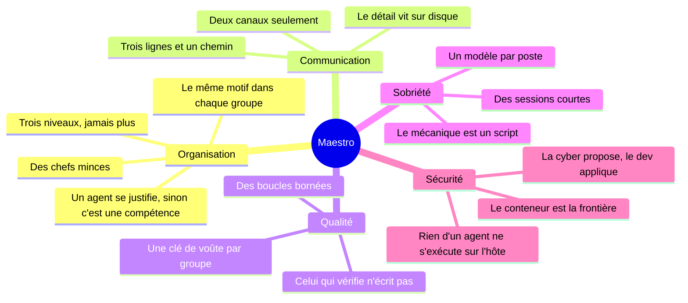

# 2. La réflexion

> Avant le code, des principes. Chacun répond à un risque observé ou prévisible, et chacun est tenu par la
> configuration plutôt que par une consigne au modèle chaque fois que c'est possible.

[← 1. Le besoin](01-besoin.md) · [Sommaire](../README.md) · [3. L'architecture →](03-architecture.md)

---

## Les principes

| Principe | Le risque qu'il écarte | Comment il est tenu |
|---|---|---|
| **Trois niveaux, jamais plus** — orchestrateur, chef, ouvrier | au-delà, chaque niveau ajoute latence, coût et perte d'information ; plus personne ne sait qui a décidé quoi | profondeur d'appel bornée par la configuration |
| **Des chefs minces** — ils choisissent la chaîne, lancent un ouvrier à la fois, tiennent la boucle, écrivent le rapport | un chef qui produit ne juge plus ce qu'il a produit | les chefs n'écrivent que dans le dossier d'état du projet |
| **Deux canaux, pas plus** — l'orchestrateur pour le séquencement, les fichiers pour le contenu | les conversations entre agents coûtent cher et ne laissent pas de trace | un chef ne peut appeler que les ouvriers de son groupe ; un besoin d'un autre groupe remonte en statut `BESOIN` |
| **Le même motif dans chaque groupe** — un amont qui cadre, un cœur qui produit, un aval qui vérifie | des vérifications complaisantes | le vérificateur n'a aucun droit d'écriture |
| **Une clé de voûte par groupe** — règles de gestion numérotées (modélisation), charte (cours), périmètre (cyber), fiche du projet (dev) | une vérification « au ressenti » | un document court, écrit une fois, chargé par tous : le verdict se rapporte à lui |
| **Des boucles bornées** — deux tours de correction, puis `BLOQUÉ` | la boucle infinie, qui brûle une nuit de calcul | protocole des chefs, budget par tâche (durée et tokens) |
| **Le détail vit sur disque** — chaque niveau ne remonte que trois lignes et un chemin | le contexte qui enfle à chaque niveau | gabarit de rapport contrôlé par un script |
| **Le mécanique est un script** — plan, journal, cartographie, contrôles | quarante appels de modèle là où un script en fait un, sans erreur | une trentaine d'outils testés sans modèle |
| **Un modèle par poste** — chef, juge, producteur, tâche mécanique | un modèle unique devient un point de panne et un poste de coût | une table de candidats par poste, sondée, avec bascule |
| **Un agent se justifie** par des permissions, une posture ou un savoir-faire distincts | la multiplication des agents | sinon, c'est une compétence chargée à la demande |
| **La cyber propose, le dev applique** | un auditeur qui « corrige » hors de tout contrôle | les correctifs partent au groupe dev via l'orchestrateur, puis re-audit ciblé |

## Les choix structurants et ce qui a été écarté

| Question | Choix | Écarté | Pourquoi |
|---|---|---|---|
| Organisation des agents | hiérarchie à trois niveaux | essaim d'agents pairs, débat entre agents, exécution parallèle en éventail | coût, traçabilité, conflits d'écriture dans un même dépôt |
| Communication | fichiers partagés et versionnés dans chaque projet | messages entre agents, protocole agent-à-agent | trace, relecture, reprise après coupure |
| Tâches mécaniques | scripts déterministes | agents | zéro token, aucun tableau cassé, testables |
| Vérification | juge sans droit d'écriture, critères écrits avant le travail | auto-vérification par le producteur | un juge qui peut corriger ne juge plus |
| Connaissance métier | compétences (*skills*) chargées à la demande, 60 lignes au plus | base vectorielle (RAG) | volume modeste, relecture humaine possible, coût de contexte maîtrisé |
| Outils externes | aucun serveur MCP | serveurs MCP | surface d'attaque et tokens de contexte, sans besoin précis |
| Orchestrateur | Claude Code, guidé par un protocole écrit et des commandes dédiées | un agent de plus dans le conteneur | le modèle le plus fiable au poste le plus critique (séquencer, arbitrer, committer), sur l'hôte, avec des permissions distinctes de celles des agents |
| Isolation des agents | conteneur Docker durci, réseau interne, sortie par mandataire | exécution directe ; machine virtuelle | la frontière réelle, à un coût supportable par un portable |
| Hébergement | PC dédié sous Linux, allumé en permanence | le poste de travail ; le cloud | le travail continue poste éteint ; maîtrise complète ; aucun coût récurrent d'hébergement |
| Recette | Docker sans privilèges, chez un compte dédié | le Docker de l'hôte | un fichier compose écrit par un agent et lancé sur le démon de l'hôte vaudrait les droits root |
| Accès à distance | réseau privé maillé et SSH par clé | redirection de port, exposition publique | aucune surface exposée sur Internet |
| Rendu du tableau de bord | côté serveur, sans bibliothèque | bibliothèques JavaScript de rendu | une politique de sécurité de contenu stricte, que ces bibliothèques ne permettent pas |

## Les arbitrages qui ont changé en route

Une bonne conception se corrige au contact du réel. Quatre décisions ont été révisées, mesures à l'appui.

1. **L'indépendance des juges a cédé devant leur disponibilité.** Les juges tournaient sur une autre famille de
   modèles que les producteurs, pour un verdict indépendant. Une limite de débit sur cette famille a suffi à bloquer
   *toutes* les tâches, puisque chacune passe par un juge. Désormais : la disponibilité d'abord, l'indépendance quand
   c'est possible (l'outil de choix des modèles l'applique seul).
2. **Une consigne ne suffit pas, une contrainte si.** « Vise huit étapes » n'a pas été suivi par les modèles légers
   (de 11 à 42 étapes mesurées). Ce qui agit : ce que la machine impose — limites d'étapes, découpage des lots par le
   chef, outils retirés.
3. **Le modèle le plus solide aux seuls chefs.** Tout mettre sur le modèle le plus solide a épuisé sa limite d'usage
   en une heure. Il est réservé aux chefs ; les ouvriers ont des modèles ouverts et un jumeau de secours chez un autre
   fournisseur.
4. **Un rendu sûr plutôt qu'une bibliothèque.** Le tableau de bord devait afficher Markdown et graphes par des
   bibliothèques JavaScript ; elles imposaient d'affaiblir la politique de sécurité de contenu. Le rendu est passé côté
   serveur, avec une liste fermée de balises.

## La méthode

- **Mesurer avant d'optimiser.** La base des sessions des agents est lue en lecture seule : chaque appel, ses tokens,
  ses outils. Les décisions d'économie partent de là, pas d'intuitions.
- **Corriger à la racine.** Chaque incident donne un correctif et un test qui le rejoue.
- **Auditer de l'extérieur.** Des audits indépendants en lecture seule, puis une vérification sur la machine réelle.
- **Prévoir le retour arrière.** Chaque mise en service a sa commande de retour, écrite avant.
- **Rien d'irréversible sans accord humain** : suppression, publication, droits élevés.

---

[← 1. Le besoin](01-besoin.md) · [Sommaire](../README.md) · [3. L'architecture →](03-architecture.md)
