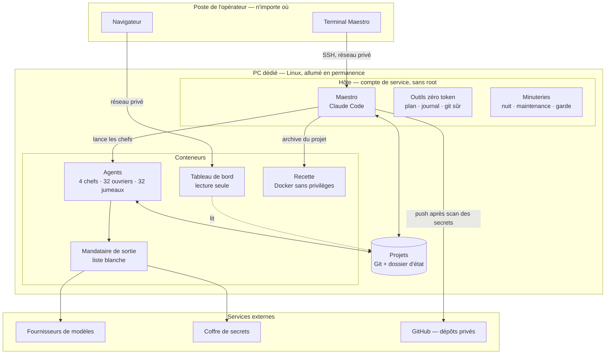
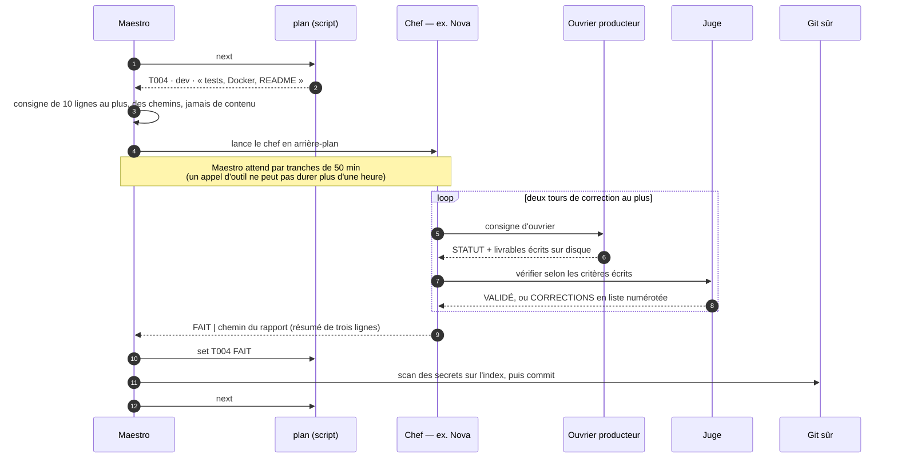
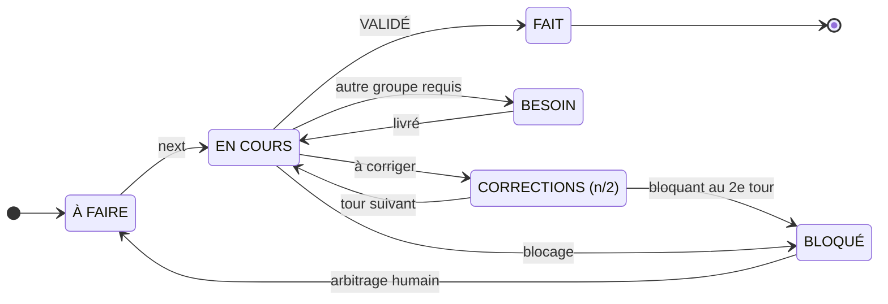

# 3. L'architecture

> Un PC dédié, quatre zones de confiance, une trentaine de scripts déterministes autour des modèles, et un état écrit
> sur disque que n'importe quelle session peut reprendre.

[← 2. La réflexion](02-reflexion.md) · [Sommaire](../README.md) · [4. Les agents →](04-agents.md)

---

## Vue d'ensemble



| Couche | Rôle | Ce qui la caractérise |
|---|---|---|
| **Hôte** | l'orchestrateur, les outils, les minuteries, l'écran de contrôle | un compte de service sans root ; il détient les secrets de l'hôte, jamais montés chez les agents |
| **Conteneur des agents** | un serveur opencode permanent qui sert tous les projets | durci (aucune capacité Linux, pas d'élévation de privilèges, mémoire et processus bornés), sur un réseau sans route vers Internet |
| **Mandataire de sortie** | la seule porte vers l'extérieur pour les agents | liste blanche de domaines, chaque refus journalisé |
| **Recette** | faire tourner l'application livrée, pour de vrai | Docker *rootless* chez un compte sans droits, mémoire et processeur bornés |
| **Tableau de bord** | voir les projets depuis un navigateur | lit les projets en lecture seule ; le dialogue avec Maestro passe par une file hors de portée des agents |

## Le cycle d'une tâche



Chaque niveau ne renvoie que **trois lignes et un chemin** : le détail (consignes, livrables, verdicts) vit sur disque,
dans le dossier d'état du projet. C'est ce qui garde le contexte de l'orchestrateur petit sur une nuit entière.

## Les états d'une tâche



Une tâche interrompue (coupure, redémarrage) reste `EN COURS` et repart en tête au run suivant, annoncée `REPRISE`.
Le plan lui-même répond par un mot que l'orchestrateur sait traiter sans réfléchir :

| Réponse de `next` | Sens | Ce que fait Maestro |
|---|---|---|
| une tâche | la prochaine tâche exécutable, une tâche restée `EN COURS` d'abord | la mène |
| `REPRISE` | la tâche avait été interrompue | la relance ; un rapport d'avant l'interruption ne fait pas foi |
| `TERMINE` | tout est `FAIT` | écrit le bilan, notifie |
| `ATTENTE` | une tâche bloquée retient les autres | s'arrête et attend un arbitrage |
| `MAINTENANCE` | la maintenance de la nuit a besoin de la machine | s'arrête entre deux tâches, sans bilan ni erreur |
| `PAUSE` | l'humain a mis ce projet en pause | finit la tâche en cours, puis s'arrête |

## Le dossier d'état d'un projet

Chaque projet est un dépôt Git. Son état vit dans un dossier caché, versionné avec le code :

```text
.maestro/
├── demande.md        la demande d'origine, figée
├── plan.md           LE fichier d'état : tenu par un script, jamais édité à la main
├── journal.md        une ligne horodatée par événement
├── taches/           une consigne par tâche (10 lignes au plus, des chemins, jamais de contenu)
├── rapports/         un rapport par tâche et par groupe ; son résumé de trois lignes remonte tel quel
├── dev/  modele/  cours/  cyber/     les espaces de travail des groupes (clés de voûte, livrables intermédiaires)
└── memoire/lecons.md                 les leçons tirées par la rétrospective
```

**Qui écrit où.** L'orchestrateur : plan, journal, consignes. Les chefs : rapports, journal, espace de leur groupe.
Les ouvriers producteurs : le code du projet. Les vérificateurs : rien — leur verdict est inscrit par le chef. Ces
règles sont tenues par la configuration des permissions, pas seulement par les consignes.

## Les outils « zéro token »

Une trentaine de scripts Bash et Python font tout ce qui est mécanique. Ils ne consomment aucun token, ne cassent
jamais un tableau Markdown, et sont tous testés sans modèle (398 tests de fumée).

| Outil | Ce qu'il fait |
|---|---|
| `plan` | crée et tient le plan : ajout, dépendances, statuts, prochaine tâche, bilan ; écriture atomique, refus d'un plan tronqué |
| `journal` | une ligne horodatée ; les sauts de ligne sont retirés (aucun faux événement ne peut être injecté) |
| `map` | inventaire technique du projet (langages, manifestes, tests, outils) en brouillon de cartographie |
| `check` | contrôles mécaniques : chaque citation `fichier:ligne` existe, gabarits respectés |
| `verify` | lance la ligne de vérification du projet seulement si sa forme est sûre (liste blanche), puis scanne les secrets |
| `chef` / `attente` | lance un chef en arrière-plan et l'attend par tranches ; chaque issue a son code (ci-dessous) |
| `git sûr` | tout Git de l'orchestrateur passe par lui : la configuration du dépôt est lue comme une donnée |
| `recette` | fait tourner l'application dans la zone de recette et rend `RECETTE OK` ou `ECHEC : étape` |
| `push` | pousse la branche du run vers un dépôt privé et ouvre la *pull request*, après un scan des secrets |
| `tokens` | coût d'une tâche, d'un agent, d'une journée, lu dans la base des sessions |
| `modeles` | sonde les modèles candidats de chaque poste et bascule ceux qui ne répondent plus |
| `superviseur` / `nuit` | mènent un projet de passe en passe, et la file des projets de la nuit |
| `processus` | vérifie qu'un numéro de processus désigne bien le programme attendu avant de s'y fier |
| `travaux` | registre des travaux longs, affiché par les interfaces |

L'attente d'un chef montre ce qu'apporte un code de sortie bien pensé : chaque cas a sa réaction, décidée une fois.

| Code | Situation | Réaction de Maestro |
|---|---|---|
| 0 | le chef a répondu | lire le statut et le résumé |
| 3 | toujours en cours | attendre une tranche de plus |
| 4 | le fournisseur du chef refuse, ou panne muette | basculer le modèle du poste, relancer |
| 5 | fini sans ligne de statut | relancer une fois en version courte |
| 6 | le serveur a redémarré pendant la tâche | relancer en reprise, une fois |
| 7 | le serveur est arrêté | laisser la tâche `EN COURS` ; le run reprendra |
| 8 | budget dépassé (150 min ou 12 M tokens relus) | arrêter le chef, lui demander un bilan |

---

[← 2. La réflexion](02-reflexion.md) · [Sommaire](../README.md) · [4. Les agents →](04-agents.md)
