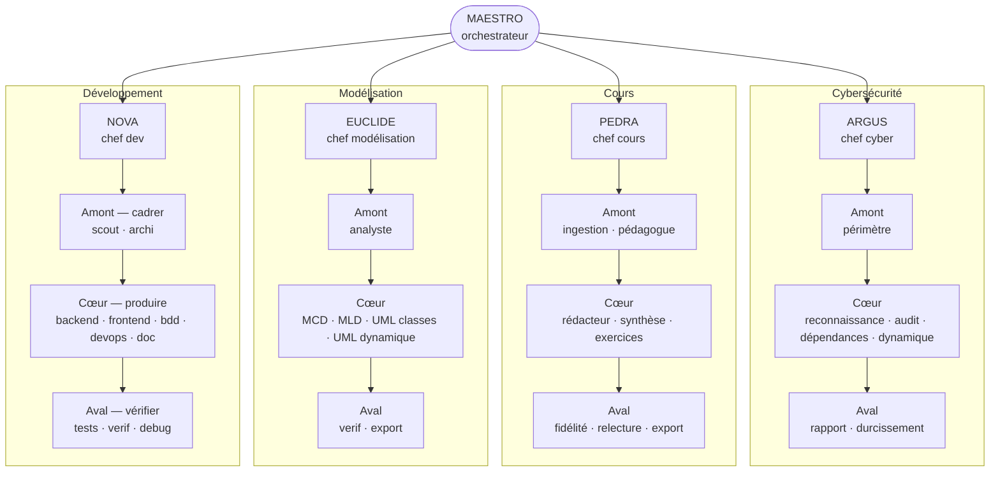
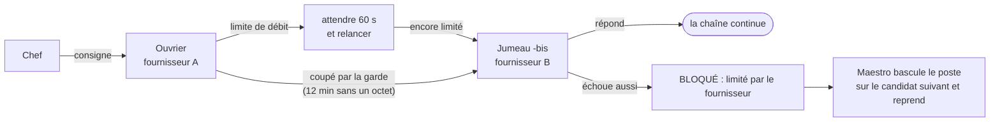

# 4. Les agents

> Soixante-dix agents définis, trois à huit réveillés par tâche. Chacun a un rôle, une posture, des droits taillés au
> plus juste et un modèle choisi pour son poste.

[← 3. L'architecture](03-architecture.md) · [Sommaire](../README.md) · [5. La sécurité →](05-securite.md)

---

## La hiérarchie complète



Les correctifs proposés par la cybersécurité ne vont jamais directement au développement : ils passent par Maestro,
qui en fait une tâche pour Nova, puis un re-audit ciblé pour Argus.

| Groupe | Chef | Amont (cadre) | Cœur (produit) | Aval (vérifie, livre) | Clé de voûte |
|---|---|---|---|---|---|
| Développement | **Nova** | scout, archi | backend, frontend, bdd, devops, doc | tests, verif, debug | la fiche du projet (40 lignes au plus, une seule ligne de vérification) |
| Modélisation | **Euclide** | analyste | MCD, MLD, UML classes, UML dynamique | verif, export | les règles de gestion numérotées |
| Cours | **Pedra** | ingestion, pédagogue | rédacteur, synthèse, exercices | fidélité, relecture, export | la charte du cours |
| Cybersécurité | **Argus** | périmètre | reconnaissance, audit, dépendances, dynamique | rapport, durcissement | le périmètre écrit |

Plus **Maestro**, l'orchestrateur, et **retro**, l'agent de rétrospective qui tire les leçons d'un projet.
À ces 38 agents s'ajoutent **32 jumeaux de secours**, un par ouvrier : 70 agents en tout.

## Les rôles

**Maestro** découpe le cahier des charges en tâches, les séquence selon leurs dépendances, écrit les consignes,
lance les chefs, inscrit leurs statuts, committe ce qui est fait et rend compte. Il ne produit jamais de livrable.

**Les chefs** sont minces : ils choisissent la chaîne d'ouvriers selon la taille de la tâche, lancent **un ouvrier à
la fois**, tiennent la boucle de correction et écrivent le rapport. Ils n'écrivent que dans le dossier d'état.

**Les ouvriers** ont chacun un métier et une posture. Ceux qui cadrent lisent ; ceux qui produisent écrivent dans
le projet ; ceux qui vérifient **n'écrivent rien** — leur verdict est inscrit par le chef.

### Des chaînes selon la taille de la tâche (développement)

| Gabarit | Chaîne | Quand |
|---|---|---|
| **S** | ouvrier → verif | une retouche localisée |
| **S-doc** | doc → verif | une tâche de documentation |
| **I** | devops → verif | infrastructure : pas de tests unitaires à écrire |
| **M** | (scout) → ouvrier(s) → tests → verif | le cas courant ; le scout seulement si la cartographie manque |
| **L** | scout → archi → bdd → backend → frontend → devops → tests → verif → doc | une fonctionnalité de bout en bout |

Les autres groupes suivent le même esprit : la modélisation pose Merise avant UML ; les cours avancent **une section
à la fois** (rédaction → fidélité → relecture), ce qui rend un cours reprenable ; la cybersécurité commence toujours
par le périmètre et n'a pas de boucle : elle trouve et propose, le groupe dev corrige, puis un re-audit ciblé ferme.

## Le protocole : des statuts, des verdicts, des limites

La **première ligne** de toute réponse d'agent est un statut, suivi du chemin du rapport :

```text
FAIT | .maestro/rapports/dev-T004.md
CORRECTIONS (1/2) | .maestro/rapports/dev-T004.md
BESOIN : modele — le MLD des tables de facturation | .maestro/rapports/dev-T004.md
BLOQUÉ : dev-tests limité par le fournisseur | .maestro/rapports/dev-T004.md
```

Le protocole de verdict est écrit **une fois**, par le générateur d'agents, dans les quatre chefs. Il est né d'une
mesure : un verdict « validé avec remarques » renvoyé en correction avait coûté 25 minutes sur 46.

1. **Le verdict est binaire, et VALIDÉ est final**, même accompagné de remarques non bloquantes.
2. **Est bloquant uniquement** : un critère de fin non couvert, une vérification en échec, une faille ou un secret,
   un livrable annoncé mais absent, une citation vers un fichier inexistant. Le style n'est jamais bloquant.
3. **Les corrections sont transmises telles quelles**, numérotées ; le juge ne recontrôle que ces numéros.
4. **Deux tours au plus.** Au deuxième, ce qui reste est soit une réserve (`FAIT`), soit un blocage (`BLOQUÉ`).
5. **Une réponse hors format n'est pas un blocage** : une relance courte, puis jugement sur pièces (les livrables
   existent-ils ?). Mesuré : deux tâches avaient été bloquées alors que le travail était fait.
6. **À bout d'étapes, livrables présents** : la chaîne continue, le juge dira ce qui manque.

Le texte exact du protocole est dans les [extraits de code](../exemples-de-code/protocole-d-un-chef.md).

## Les jumeaux de secours

Chaque ouvrier a un jumeau, `<ouvrier>-bis` : même rôle, mêmes compétences, **mêmes permissions au bit près**
(vérifié automatiquement), mais un modèle chez **un autre fournisseur**.



Mis à l'épreuve la nuit du 4 au 5 octobre : coupure réseau du conteneur de trois minutes en pleine tâche, puis
limite de débit sur le modèle des juges. Le chef a relancé l'ouvrier après le retour du réseau, attendu, puis appelé
le jumeau, qui a validé — sans intervention humaine.

## Un modèle par poste

| Poste | Agents | Modèle nominal | Candidats de secours, dans l'ordre |
|---|---|---|---|
| Orchestrateur | Maestro | Claude Code (Sonnet) | — |
| Chef | Nova, Euclide, Pedra, Argus | GPT-6 astra | mimo, longcat, nemotron ultra |
| Juge | les vérificateurs de chaque groupe | longcat 2.5 | nemotron ultra, mimo, GPT |
| Producteur | backend, frontend, rédacteur, auditeur… | mimo v2.6 flash | nemotron lightning, nemotron ultra, longcat, GPT |
| Mécanique | cartographie, export, documentation… | mimo v2.6 flash | nemotron lightning, nemotron ultra, GPT |

Un outil sonde les candidats et retient, pour chaque poste, le premier qui répond ; le choix est passé au serveur
**sans toucher au dépôt**, et le nominal revient de lui-même quand tout répond à nouveau. Deux règles d'inscription :
un modèle n'entre dans la table qu'après avoir passé les tests comportementaux des agents, et les juges prennent si
possible une autre famille que les producteurs.

## Des permissions taillées par classe

Les droits sont générés par classe d'agent, puis **vérifiés automatiquement : 17 674 vérifications** rejouent ce que
chaque agent peut et ne peut pas faire (lire, écrire par chemin, lancer telle commande, appeler tel agent, charger
telle compétence).

| Classe | Écrire | Commandes | Exemple |
|---|---|---|---|
| Lecture seule | rien | lecture, recherche | scout, analyste, périmètre |
| Dossier d'état | le dossier d'état seulement | lecture, contrôles | chefs, cartographie |
| Producteurs | le projet | shell large, mais sans toucher à l'état du dépôt | backend, rédacteur, durcissement |
| Tests | les fichiers de tests | lancer les tests du projet | tests |
| Vérificateurs | **rien** | lecture, lancer la vérification | verif, fidélité, relecture |
| Export | le dossier d'export | outils de conversion connus | export |

Quelques règles nées d'incidents réels :

- **L'état du dépôt Git est réservé à Maestro** : `stash`, `reset`, `checkout`, `clean`, `rebase`, `merge`… sont
  refusés aux ouvriers depuis qu'un ouvrier a fait disparaître le plan du run par un `git stash`.
- **Aucune liste de tâches interne** : l'outil a été retiré à tous les agents (le plan est sur disque) — il coûtait
  176 étapes et 4,8 millions de tokens.
- **Les fichiers de secrets sont illisibles** (`.env*`), sauf le modèle d'exemple `.env.example`.
- **Pas de redirection, pas de chemin absolu ni de remontée `../`** pour ceux qui n'écrivent qu'avec l'outil
  d'édition. Ces règles arrêtent les maladresses ; la frontière de sécurité réelle reste le conteneur.

## Les compétences (*skills*)

49 compétences, chargées à la demande. Un gabarit fixe — *Quand l'utiliser · Procédure · Pièges connus · Sortie
attendue · Vérification* — et 60 lignes au plus. Trois étagères :

- **rôle** : une par ouvrier (comment auditer, comment écrire un MCD, comment tester) ;
- **pile technique** : PHP, PHPUnit, Docker Compose, Python… choisies par la fiche du projet ;
- **commun** : orchestration, protocole, création de compétences, rétrospective.

Chaque agent ne voit que les siennes : moins de tokens de contexte, pas de dérive de rôle. La rétrospective écrit
ses leçons au bon endroit — un piège général dans la compétence, un fait propre au projet dans sa fiche, une leçon
de méthode dans la mémoire du projet — et chaque ajout est relu par l'humain avant d'entrer dans le dépôt.

## Les commandes

| Commande | Effet |
|---|---|
| `/projet` | cartographie un projet existant et écrit sa fiche |
| `/spec <cahier>` | transforme un cahier des charges en plan de tâches, puis s'arrête pour relecture |
| `/run [N]` | mène les N prochaines tâches du plan |
| `/auto <cahier>` | `/spec` puis `/run`, jusqu'au bout |
| `/statut` | l'état du plan, sans réveiller aucun agent |
| `/retro` | tire les leçons du projet |
| `/dev` `/modele` `/cours` `/cyber` | parler directement à un chef, sans plan |

---

[← 3. L'architecture](03-architecture.md) · [Sommaire](../README.md) · [5. La sécurité →](05-securite.md)
