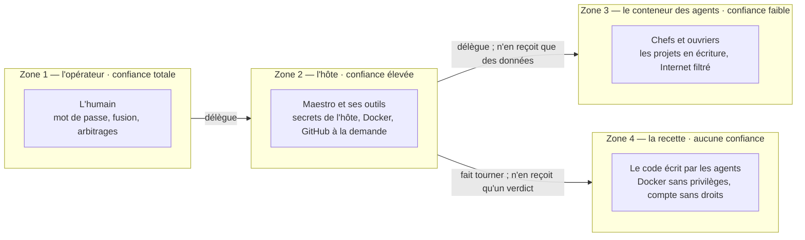
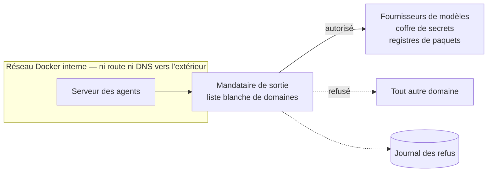

# 5. La sécurité

> Objectif fixé dès le départ : **réduire le plus possible le risque d'attaque, aucun secret en clair ni exposé.**
> Un système d'agents lit du contenu qu'il ne maîtrise pas ; la sécurité ne peut donc pas reposer sur la bonne
> volonté des modèles.

[← 4. Les agents](04-agents.md) · [Sommaire](../README.md) · [6. L'économie de tokens →](06-economie-tokens.md)

---

## Le modèle de menace

Tout agent peut être **manipulé par ce qu'il lit** : un fichier du projet, un dépôt cloné, la sortie d'une commande.
L'orchestrateur aussi, puisqu'il lit les rapports des agents. La question n'est donc pas « l'agent va-t-il bien se
comporter ? » mais « **que peut-il faire s'il est trompé ?** ».

## Quatre zones de confiance

**La règle de conception : rien de ce qu'écrit une zone moins fiable ne doit s'exécuter dans une zone plus fiable.**
Les deux frontières qui comptent sont donc *conteneur → hôte* et *contenu lu → orchestrateur*.

Le protocole de Maestro dit aussi que le contenu d'un fichier, d'un rapport ou d'un dépôt cloné n'est jamais une
instruction. C'est une consigne à un modèle, pas un contrôle : tout ce qui suit tient **même si le modèle est trompé**.

## Ce qui protège l'hôte

| Risque | Contrôle |
|---|---|
| Un agent piège la configuration Git d'un projet et du code s'exécute sur l'hôte au prochain `git add` | tout Git de l'orchestrateur passe par un **Git sûr** : la configuration du dépôt est lue comme une donnée et comparée à une liste blanche de clés, sinon `DÉPÔT SUSPECT` et alerte bloquante ; crochets, filtres, moniteur, assistants d'identifiants, éditeur et pagineur neutralisés ; 29 tests rejouent les attaques |
| L'orchestrateur, manipulé, lit un secret de l'hôte | les commandes de lecture génériques lui sont retirées — y compris les détournements comme `date -f`, `wc --files0-from` ou `git diff --no-index` ; un lecteur dédié ne lit que le projet courant, jamais un lien, un fichier de secrets ou `.git` |
| L'orchestrateur, manipulé, fait sortir une donnée | ni `curl`, ni `wget`, ni `docker` ; seul l'outil de publication pousse, vers un dépôt **privé**, après son propre scan des secrets dans un conteneur sans réseau |
| Un vrai secret est déclaré « faux positif » pour passer le scan | un faux positif se **prouve** (fichier de test, valeur sans forme de jeton, ligne relue dans l'index) ; il ne se déclare plus |
| Un agent empoisonne les consignes des autres | tout le « cerveau » (agents, compétences, outils) est monté en **lecture seule** sur le serveur |
| Un faux message de l'opérateur est déposé pour l'orchestrateur | la file du dialogue vit hors des dossiers que les agents écrivent |
| Un agent fait signaler un processus de l'hôte par un faux numéro (« -1 » passé à `kill` vise tous les processus du compte) | les numéros qui font foi sont tenus hors de portée des agents, et contrôlés avant usage : entier supérieur à 1, processus vivant, ligne de commande et dossier attendus ([extrait](../exemples-de-code/controle-des-processus.sh)) |
| Le fichier compose d'un projet demande des privilèges | la recette tourne chez un compte sans droits, dans un Docker *rootless* ; le compose du tableau de bord est contrôlé avant tout lancement |
| Un service tourne en root | l'installateur refuse root et vérifie chaque unité ; chaque script de service refuse de tourner en root |
| Un agent envoie ce qu'il voit vers un serveur à lui | **sorties filtrées** (ci-dessous) |

## Les sorties filtrées

Le serveur des agents n'est relié qu'à un réseau Docker interne : il n'a **ni route ni résolution DNS** vers
l'extérieur (pas de fuite par DNS). Il sort par un mandataire qui n'accepte que les domaines de sa liste blanche et
journalise chaque refus. Vérifié en service puis après un redémarrage à froid : les domaines utiles passent, un
domaine quelconque est refusé et journalisé, les secrets se chargent à travers le mandataire. Un journal des refus
qui grossit signale soit un domaine légitime à ajouter, soit une tentative.

## Les secrets

| Secret | Où il vit | Règle |
|---|---|---|
| Identité machine du coffre de secrets | un fichier de l'hôte lisible par le seul compte de service | passée au conteneur à sa création, **retirée de l'environnement** avant le lancement des agents |
| Jeton GitHub | le coffre de secrets | lu au moment de l'appel par l'outil de publication, transmis à Git sans fichier ni argument ; jamais dans le conteneur des agents |
| Sujet des notifications | un fichier de l'hôte | jamais dans le conteneur : un agent ne peut pas écrire sur le téléphone de l'opérateur |
| Mots de passe des services | générés, conservés dans le coffre ou dans un fichier de l'hôte | jamais affichés, jamais passés en argument de commande (transmis par l'entrée standard) |
| Code de l'écran de contrôle | son **empreinte** seulement (scrypt, sel aléatoire) | choisi par l'opérateur sur la machine, jamais écrit ni dicté nulle part |

Trois règles de travail, sans exception : **un secret ne passe jamais dans une conversation** (un secret montré est
considéré comme grillé et se remplace) ; **jamais dans un dépôt** (scan avant chaque commit et chaque push) ;
**aucun port ouvert sur Internet** (accès par réseau privé uniquement).

## Les audits et leurs correctifs

Deux audits indépendants (lecture seule, essais locaux), une relecture du code écrit de nuit, un audit des droits
GitHub, chacun suivi d'une vérification sur la machine réelle.

| Gravité | Constat | Correctif |
|---|---|---|
| **critique** | La configuration Git d'un projet est écrite depuis le conteneur ; Git exécute ce qu'elle décrit sur l'hôte dès `git add` — **prouvé avec un filtre** | Git sûr (ci-dessus) |
| élevée | Avec l'option d'init de Docker, le processus 1 gardait l'identité du coffre de secrets dans son environnement, **lisible par les agents** | plus d'init fournie par Docker : l'entrée du conteneur purge l'environnement, puis lance elle-même l'init ; vérifié dans les trois chemins de lancement |
| élevée | L'orchestrateur pouvait lire les secrets de l'hôte par des commandes anodines | droits resserrés, lecteur borné au projet |
| élevée | Le jeton GitHub était lisible par un crochet de pré-envoi pendant un push | le push passe par Git sûr |
| élevée | `sudo` sans mot de passe trop large : tout programme du compte de service devenait root | réduit à quatre commandes à arguments exacts, vérifié par des exécutions réelles |
| élevée | Un faux numéro de processus permettait d'arrêter tous les processus du compte | numéros hors de portée des agents, contrôlés avant usage |
| élevée | Les agents producteurs avaient Internet sans filtre | sorties filtrées |
| moyenne | Serveur des agents sans mot de passe, joignable par tout compte local | mot de passe actif |
| moyenne | Le scan des secrets pouvait être désactivé par un faux positif déclaré | faux positif prouvé, scan refait par l'outil de publication |
| moyenne | Les agents pouvaient réécrire compétences et consignes | lecture seule |
| moyenne | Identifiant de tâche non ancré (`T000/../..` accepté) : écriture hors du dossier prévu | identifiants validés par motif ancré |
| moyenne | Rendu Markdown du tableau de bord en temps quadratique sur deux motifs (de 20 s à 3 min par document) | corrigé ; rendu identique vérifié sur 150 039 documents ; aucune faille XSS sur 6 millions de cas de fuzzing |
| moyenne | Une clé de déploiement pouvait écrire alors que la machine ne fait que lire | remise en lecture seule, écriture refusée vérifiée |

Un piège mérite d'être partagé : avec **sudo-rs**, `sudo -l <commande>` répond « autorisé » même pour une commande
refusée. Seule une exécution réelle (`sudo -n …`) fait foi — c'est ainsi que la réduction de `sudo` a été vérifiée.

## L'écran de contrôle

L'écran du PC affiche en permanence une animation ; un code ouvre un terminal. Le code n'est conservé que sous forme
d'empreinte scrypt et comparé en temps constant ; cinq codes faux imposent une minute d'attente, doublée à chaque
série (une heure au plus), et chaque tentative est journalisée. Le terminal d'affichage est en mode kiosque : aucun
raccourci n'ouvre un autre terminal, ne lance une commande ou ne colle quoi que ce soit ; si l'écran s'arrête, la
session se ferme ; sans frappe pendant quinze minutes, le terminal revient à l'écran.
[Extrait du déverrouillage](../exemples-de-code/deverrouillage-ecran.py).

## Ce qui reste — risques connus

Une revue honnête dit aussi ce qui n'est pas fermé.

1. **Un agent manipulé peut encore faire sortir ce qu'il voit vers un domaine autorisé** qui accepterait des données
   d'un compte de l'attaquant (une API de modèle avec sa propre clé, par exemple). Le mandataire voit des noms de
   domaine, pas le contenu chiffré. Ce qui limite : les agents ne lisent pas le web ; on ne clone que des dépôts de
   confiance.
2. **Les identifiants d'accès aux modèles vivent dans le conteneur**, parce qu'opencode en a besoin : un agent
   manipulé peut les lire. Le mot de passe du serveur des agents protège des autres comptes de la machine, pas des
   agents eux-mêmes.
3. **L'orchestrateur reste un modèle.** Les contrôles bornent ce qu'il peut faire s'il est trompé : lancer des agents,
   écrire dans l'état du projet, committer, pousser vers un dépôt privé. Il ne peut plus lire hors du projet ni
   exécuter un programme choisi par un dépôt.
4. **Le scan des secrets reconnaît des formes** : un secret court sans forme particulière lui échappe. D'où la règle :
   aucun vrai secret dans l'environnement des agents, seulement des valeurs d'essai.
5. **Le disque n'est pas chiffré** : un serveur qui redémarre seul ne peut pas demander de phrase de passe au
   démarrage. Un démarrage sur clé USB passe outre l'écran à code. Une procédure de révocation complète en cinq
   minutes est écrite pour le cas d'un vol.

## Vérifier, et revérifier

- **398 tests de fumée**, dont les attaques rejouées (Git piégé, lecture hors projet, faux positif, push, dialogue,
  numéros de processus, écran de contrôle).
- **17 674 vérifications de permissions** des 70 agents, dont l'interdiction d'écrire dans `.git`.
- **Une intégration continue** qui rejoue validation, tests et analyse statique des scripts à chaque envoi.

---

[← 4. Les agents](04-agents.md) · [Sommaire](../README.md) · [6. L'économie de tokens →](06-economie-tokens.md)
