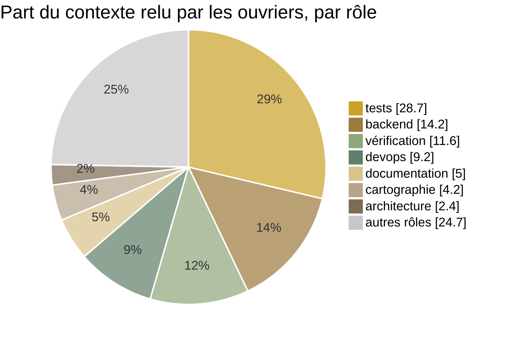

# 6. L'économie de tokens

> Consommer le moins de tokens possible **sans perdre en qualité**. Ce chapitre part des mesures — chaque appel de
> modèle, ses tokens, ses outils, lus dans la base des sessions — pas d'intuitions.

[← 5. La sécurité](05-securite.md) · [Sommaire](../README.md) · [7. L'exploitation →](07-exploitation.md)

---

## Où partent les tokens

Mesuré sur les trois premiers jours de service (du 3 au 5 octobre 2026) :

| Qui | Appels de modèle | Tokens relus | Tokens produits |
|---|---:|---:|---:|
| Ouvriers et juges (modèles ouverts) | 3 133 | 104 M | 2,7 M |
| Chefs (GPT) | 800 | 11 M | 0,13 M |
| Maestro (Claude Code) | 343 | 13 M | 0,09 M |

Trois constats ont orienté tout le reste :

1. **85 % des tokens sont du contexte relu**, pas du travail nouveau. À chaque étape, le modèle relit tout ce qui
   précède dans sa session : consigne, fichiers lus, commandes et leurs sorties, et son propre raisonnement.
2. **Le contexte d'un ouvrier grossit à chaque étape.** Médianes mesurées : l'ouvrier de tests passe de 8,5 k tokens
   au début à 56 k à la fin ; le frontend de 8,5 k à 58 k. Le raisonnement du modèle reste dans le contexte : d'une
   étape à la suivante, le contexte grossit d'environ **un token par token de raisonnement** (régression sur 2 561
   étapes d'ouvriers).
3. **Une tâche peut coûter dix fois une autre.** Une tâche prise dans une boucle de corrections a relu 22,9 M tokens
   en 3 h 16 — à elle seule 19 % de tout ce que le système avait consommé ; une tâche ordinaire relit de 1,6 à 7 M.

## Le modèle de coût

Pour une session de $n$ étapes dont le contexte part de $c_0$ tokens et grossit de $g$ tokens par étape, le total relu
est la somme d'une progression arithmétique :

$$
\text{relu} \;=\; \sum_{k=0}^{n-1} \left(c_0 + k\,g\right) \;=\; n\,c_0 + \frac{g\,n(n-1)}{2} \;\approx\; n\,c_0 + \frac{g\,n^2}{2}
$$

Le terme en $n^2$ domine dès quelques étapes. Avec les valeurs mesurées sur l'ouvrier de tests
($c_0 \approx 8{,}5$ k, $g \approx 2{,}5$ k), pour un même travail de 16 étapes :

| Découpage | Calcul | Tokens relus |
|---|---|---:|
| une session de 16 étapes | 16 × 8,5 k + 2,5 k × 16 × 15 / 2 | **436 k** |
| deux sessions de 8 étapes | 2 × (8 × 8,5 k + 2,5 k × 8 × 7 / 2) | **276 k** (− 37 %) |
| quatre sessions de 4 étapes | 4 × (4 × 8,5 k + 2,5 k × 4 × 3 / 2) | **196 k** (− 55 %) |

Le découpage a pourtant un optimum : chaque session de plus coûte un appel et une relecture au chef, et repaie $c_0$.
Le [modèle de coût est en code](../exemples-de-code/modele-de-cout.py), avec ces exemples et une estimation de $c_0$
et $g$ à partir de contextes mesurés.

## Les leviers, dans l'ordre

1. **Moins d'étapes ($n$)** : grouper les lectures dans une même réponse, enchaîner les commandes, écrire chaque
   fichier une fois.
2. **Moins de croissance ($g$)** : lire des fenêtres plutôt que des fichiers entiers, modifier un passage plutôt que
   réécrire un fichier, garder les fichiers courts, moins de raisonnement là où il n'apporte rien.
3. **Des sessions courtes** : deux sessions de huit étapes coûtent moins qu'une de seize.
4. **Pas de boucles** : un budget par tâche coupe ce qui tourne en rond.
5. **Moins d'ouvriers par tâche** quand la tâche est petite.

Et ce qui ne doit **pas** bouger : la vérification indépendante, les tests écrits d'après les critères, la recette
Docker réelle. Économiser là ferait payer plus tard, en tours de correction.

## Première optimisation : le protocole et les scripts (3 octobre)

Même commande (`/projet` : cartographier un projet et écrire sa fiche), même projet, même modèle, avant et après un
audit complet suivi de cinq lots de correctifs :

| | Avant | Après | Confirmation |
|---|---:|---:|---:|
| Durée | 46,1 min | 7,3 min | **3,2 min** |
| Appels de modèle | 152 | 32 | **24** |
| Tokens relus (hors cache / en cache) | 345 k / 2 607 k | 76 k / 321 k | **43 k / 218 k** |
| Tokens de raisonnement | 116 k | 3,9 k | **3,2 k** |
| Tours de vérification | 3 | 1 | **1** |

Le gain vient pour moitié du **protocole** (plus de ping-pong sur des numéros de ligne de citation, verdict validé
final) et pour moitié des **scripts** (la cartographie et les contrôles faits sans modèle).

## Ce qui est en place

| Mesure | Levier |
|---|---|
| Budget par tâche : 150 min ou 12 M tokens relus, puis arrêt et bilan au lieu de boucler | 4 |
| Coût de chaque tâche inscrit au journal ; commande `/tokens` dans l'interface | mesure |
| Outil de liste de tâches interne retiré à tous les agents (176 étapes, 4,8 M tokens économisés) | 1 |
| Chefs : un appel d'ouvrier par étape, contrôles groupés, ni liste de tâches ni relecture des livrables | 1 |
| Tests : un fichier par domaine au-delà de 400 lignes ; jamais la lecture d'un gros fichier entier | 2 |
| Effort de raisonnement réduit pour 14 rôles mécaniques | 2 |
| Le chef confie l'écriture des tests **un module à la fois** (six fichiers de tests au plus par appel) | 1, 3 |
| Limites d'étapes imposées : producteurs 40, tests 25 ; à bout d'étapes, le chef relance sur la part restante | 1 |
| Une réponse d'ouvrier hors format est relancée une fois, puis jugée sur pièces, au lieu de bloquer la tâche | 4 |
| Contrôle du démarrage Docker dès la tâche Docker, au lieu d'un tour de correction à la recette | 4 |

## Le banc d'essai (6 octobre)

Même tâche (tests PHPUnit de quatre classes, outillage, parcours Docker, README), même état de départ, même consigne,
mêmes modèles, avant et après la première série d'économies :

| | Avant | Après | Écart |
|---|---:|---:|---:|
| Durée | 30 min 43 s | 31 min 23 s | = |
| Étapes (appels de modèle) | 121 | 130 | + 7 % |
| Tokens relus | 4,45 M | 4,16 M | **− 6,5 %** |
| Chef : étapes / tokens relus | 22 / 0,33 M | 18 / 0,24 M | **− 18 % / − 27 %** |
| Appels à la liste de tâches interne | 13 | 0 | |
| Ouvrier de tests : tokens relus | 1,68 M | 1,12 M | − 33 % |
| Vérificateur : tokens relus | 0,66 M | 0,25 M | − 62 % |

Ce que le banc a appris — et c'est sa vraie valeur :

- **Ce qui agit, c'est ce que la configuration impose** (outil retiré, chef plus sobre). **Ce qui n'agit pas : la
  consigne** « vise huit étapes » — les ouvriers légers ont fait de 11 à 42 étapes. D'où la deuxième série : des
  limites imposées par la machine, et le découpage par le chef, dont les consignes, elles, sont suivies.
- **Une seule paire de mesures ne sépare pas l'effet d'un réglage du hasard des modèles** : d'un essai à l'autre, un
  même ouvrier varie du simple au triple. D'où la campagne ci-dessous.
- **Le gaspillage le plus net était ailleurs** : les deux essais ont fini bloqués pour une réponse d'ouvrier hors
  format, alors que le travail était fait. Un blocage coûte une reprise, ou un arbitrage humain — bien plus que les
  économies mesurées. La règle « hors format » est née là.

## Écartés par la mesure

- **Un effort de raisonnement plus bas que « faible »** : le fournisseur ne l'honore pas pour le modèle des ouvriers
  (« minimal » ne réduit rien ; « aucun » fait exploser le raisonnement et casse le format des réponses).
- **Le compactage du contexte en cours de tâche** : le mode d'exécution des agents ne compacte pas, même avec un seuil
  extrême.

## La campagne économie/puissance (nuit du 6 au 7 octobre)

Pour séparer l'effet des réglages du hasard des modèles, **douze essais** rejouent deux tâches de référence depuis
leur état de départ, chacune deux fois, sous trois configurations : **V1** (avant les économies), **V2** (actuelle),
**V2N** (V2 avec un autre modèle pour les ouvriers). Chaque essai vérifie dans le serveur que la configuration voulue
est bien chargée, puis mesure les deux côtés :

| Puissance (sur 10) | Points |
|---|---:|
| Le chef rend `FAIT` | 4 |
| La vérification du projet est verte | 2 |
| L'application démarre dans Docker | 2 |
| Les livrables attendus sont là (fichiers de tests, cible `make test`, README, fichiers ignorés…) | 2 |

**Coût** : tokens relus, ceux du modèle des chefs comptés triple (c'est la ressource la plus rare). La configuration
gagnante n'est mise en service que **si sa puissance ne baisse pas**. Les résultats seront publiés ici à l'issue de la
campagne.

---

[← 5. La sécurité](05-securite.md) · [Sommaire](../README.md) · [7. L'exploitation →](07-exploitation.md)
