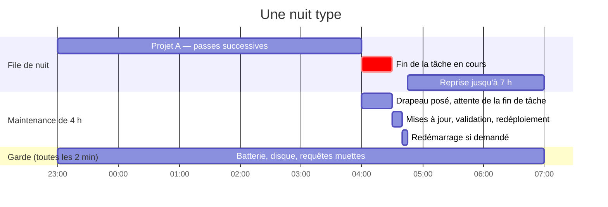
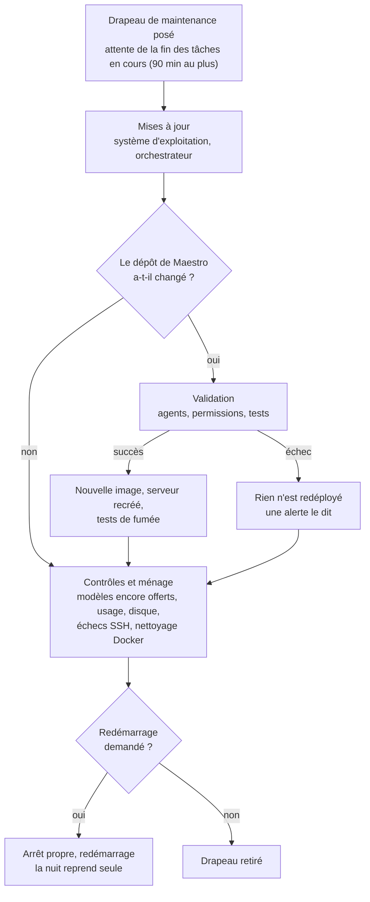

# 7. L'exploitation

> Un serveur qui travaille quand personne ne regarde doit savoir s'arrêter proprement, se mettre à jour, reprendre
> après une coupure, contourner un fournisseur en panne — et ne réveiller l'humain que lorsque rien n'avance sans lui.

[← 6. L'économie de tokens](06-economie-tokens.md) · [Sommaire](../README.md) · [8. Les interfaces →](08-interfaces.md)

---

## Le jour, la nuit

**Le jour** est fait de travaux courts et interactifs. **Les runs de plusieurs heures vont dans la file de nuit** : à
23 h, une minuterie mène chaque projet de la file, l'un après l'autre, de passe en passe, jusqu'à 7 h. Un projet
terminé ou arrêté sur un blocage sort de la file ; un projet arrêté par l'heure y reste et continue la nuit suivante.

## La maintenance automatique

Chaque nuit à 4 h, sans intervention :

Le **drapeau de maintenance** est la pièce maîtresse : tant qu'il existe, le plan répond `MAINTENANCE` et
l'orchestrateur s'arrête *entre deux tâches*, sans bilan ni erreur. La tâche en cours garde son état, le run suivant
reprend exactement là.

## La garde

Toutes les deux minutes, une garde vérifie :

| Quoi | Seuil | Réaction |
|---|---|---|
| Batterie (le PC est un portable) | en décharge sous 15 % | drapeau, arrêt propre du serveur, extinction |
| Disque | sous 10 % | alerte ; sous 2 % ou 2 Go : drapeau, plus aucune nouvelle tâche |
| Requêtes muettes | un appel de modèle sans un octet reçu depuis 12 min | la session de l'ouvrier est interrompue ; son chef appelle le jumeau |
| Ses propres minuteries | une unité absente ou vide | alerte |

La dernière ligne vient d'un incident : un fichier de minuterie s'était retrouvé **vide** après une réinstallation,
et la garde batterie n'avait pas tourné de la nuit — sans conséquence, mais sans que rien ne le signale.
L'installateur refuse désormais une unité vide, et la maintenance vérifie ses propres minuteries.

## Éprouvé, pas supposé

Chaque mécanisme de reprise a été provoqué volontairement, ou vécu en vrai, avant d'être considéré comme acquis.

| Scénario | Ce qui s'est passé | Verdict |
|---|---|---|
| Drapeau de maintenance posé en pleine tâche | l'orchestrateur a fini la tâche, s'est arrêté sans bilan, plan intact | réussi |
| Serveur des agents arrêté en pleine tâche | le chef meurt sans un mot ; l'attente le prenait pour « sans statut » → nouveau code « serveur arrêté » : la tâche reste en cours, le run reprendra | corrigé puis réussi |
| Coupure réseau du conteneur pendant 3 min | l'ouvrier échoue, le chef le relance au retour du réseau ; le juge, limité par son fournisseur, est remplacé par son jumeau ; tâche validée | réussi, sans intervention |
| Maintenance réelle avec redémarrage, en plein run de nuit | mises à jour appliquées, arrêt propre, redémarrage à 4 h 35 ; machine, réseau, Docker et serveur revenus seuls à 4 h 44 ; run repris | réussi |
| Redémarrage à froid du PC | tous les services repartis seuls en 46 secondes ; toutes les vérifications refaites et bonnes | réussi |
| Panne muette d'un fournisseur (requêtes sans réponse ni erreur) | un ouvrier figé 34 min → création de la garde des requêtes muettes et de la bascule vers le jumeau | corrigé |
| Limites d'usage successives de trois fournisseurs dans la même soirée | sonde des modèles, bascule poste par poste, sans toucher au dépôt | corrigé puis outillé |

## Quand un fournisseur tombe

Avant chaque tâche, et sur toute panne, l'orchestrateur sonde les modèles candidats de chaque poste et retient le
premier qui répond. Le choix est passé au serveur sous forme de surcharge, **sans modifier le dépôt** ; quand tout
répond de nouveau, la surcharge disparaît et le modèle nominal revient. Si aucun candidat ne répond, le run s'arrête
en donnant l'heure de retour annoncée par le fournisseur.

## Ce qui ne peut pas corrompre un run

- **Le plan s'écrit de façon atomique** (fichier temporaire dans le même dossier, puis renommage), et une réécriture
  qui perdrait des tâches est refusée.
- **Une tâche interrompue reste `EN COURS`** et revient en tête au run suivant, annoncée `REPRISE` ; un rapport d'avant
  l'interruption ne fait pas foi.
- **Une extinction est propre** : le serveur reçoit le signal d'arrêt et dispose de 60 secondes ; il repart seul au
  démarrage.
- **Une mise à jour ratée ne déploie rien** : le serveur reste sur l'image précédente, une alerte le dit.

## Rendre compte, sans déranger

L'opérateur est notifié sur son téléphone **seulement quand rien n'avance sans lui** : run arrêté en attente
d'arbitrage, serveur qui ne repart pas, batterie ou disque critiques, minuteries cassées. Le reste — fin de run
réussie, tâche bloquée isolée, requête muette coupée, alertes ordinaires — est journalisé, visible dans le tableau
de bord et dans le compte rendu de la nuit. Le sujet des notifications ne quitte jamais l'hôte : un agent ne peut pas
écrire sur le téléphone de l'opérateur.

## Se piloter de n'importe où

- **Le terminal Maestro**, par SSH sur le réseau privé, depuis n'importe quel poste de l'opérateur — ou depuis un
  poste étranger, par le réseau privé avec double authentification.
- **Le tableau de bord web**, sur le réseau privé uniquement.
- **Une copie lisible des projets** dans un coffre Obsidian : graphe des agents, plan de chaque projet, frise du
  journal — tenue à sens unique depuis l'hôte, sans rien monter de plus chez les agents.

Aucun port n'est ouvert sur Internet.

---

[← 6. L'économie de tokens](06-economie-tokens.md) · [Sommaire](../README.md) · [8. Les interfaces →](08-interfaces.md)
