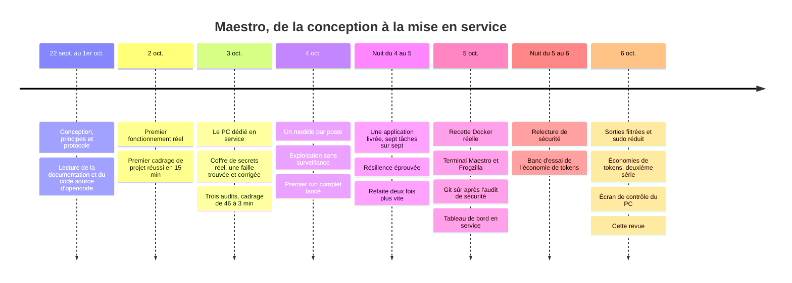

# La chronologie

> De la conception à la mise en service : deux semaines de conception, puis cinq jours de réel où chaque journée a
> apporté son lot de mesures, d'incidents et de correctifs.

[← 9. Les résultats](09-resultats.md) · [Sommaire](../README.md)

---

## Conception — du 22 septembre au 1er octobre

- Les principes, les effectifs des quatre groupes, le protocole de fichiers partagés, les statuts.
- Les faits techniques **vérifiés à la source** plutôt que supposés : la documentation et le schéma officiels
  d'opencode, puis son code source pour la sémantique exacte des permissions (un motif est un joker ancré aux deux
  bouts, pas un glob ; les chemins sont relatifs à la racine Git du projet). Ces règles sont rejouées par des tests.
- Les emprunts assumés à la littérature sur l'artisanat des agents (branche Git par run, scripts déterministes, modèle
  de repli, définition de « terminé », journal structuré, tests d'injection) et les écarts assumés (pas de RAG, pas
  de débat entre agents, pas d'exécution en éventail).

## 2 octobre — le premier fonctionnement réel

- Validation complète : 38 agents, 49 compétences, 10 commandes, 3 520 vérifications de permissions, 4 tests
  comportementaux sur 4.
- Premier cadrage réel d'un projet : **fait en 15 minutes**. Un ouvrier a annoncé deux fois un fichier qu'il n'avait
  pas écrit ; son chef l'a détecté et la boucle de correction a abouti.
- Le mode serveur : un run continue quand son client se déconnecte.

## 3 octobre — le PC dédié

- Ubuntu Server sur un portable dédié, Docker, le serveur des agents permanent, l'accès par réseau privé, le coffre de
  secrets réel.
- **Première faille trouvée par le réel** : avec l'option d'init de Docker, l'identité du coffre restait lisible par
  les agents dans l'environnement du processus 1. Corrigée le jour même et vérifiée dans les trois chemins de
  lancement.
- Choix du modèle des ouvriers après un essai comparé sur le même cadrage.
- Redémarrage à froid vérifié : tout revient seul.
- Le soir, **trois audits** (robustesse, cybersécurité, efficacité : 71 constats) puis cinq lots de correctifs. Le même
  cadrage passe de **46 minutes à 3 minutes**, de 152 à 24 appels de modèle.

## 4 octobre — l'organisation des modèles et l'autonomie

- **Un modèle par poste** : Claude Code en orchestrateur, GPT pour les chefs, des modèles ouverts pour les ouvriers et
  les juges, chacun avec ses candidats de secours.
- **L'exploitation sans surveillance** : arrêt propre, drapeau de maintenance, maintenance planifiée à 4 h, garde
  batterie, notifications.
- Le coffre Obsidian : une note par agent et par compétence, l'organigramme en graphe, un tableau de bord par projet.
- À 18 h 54, **le premier run complet** est lancé depuis un cahier des charges.

## Nuit du 4 au 5 octobre — la preuve par la nuit

- 21 h 07 : l'orchestrateur s'arrête seul (un appel d'outil ne dépasse pas une heure) → chefs en arrière-plan,
  attente par tranches.
- 23 h : un juge part en boucle de raisonnement → sortie plafonnée, relance courte.
- 23 h 15 – 23 h 49 : **tests de résilience** — drapeau de maintenance en plein run, serveur arrêté en pleine tâche,
  coupure réseau de trois minutes. Une limite de débit sur les juges bloque tout → **jumeaux de secours**.
- 2 h 31 : **l'application est livrée, sept tâches sur sept**, audit de sécurité et re-audit compris.
- 4 h : la maintenance passe en vrai, redémarre la machine ; tout revient seul en neuf minutes.
- 6 h 23 : **la même application, refaite après les correctifs : six tâches sur six**, deux fois plus vite, sans
  relance ni arbitrage.

## 5 octobre — de la démonstration au service

- Jumeaux de secours pour les 32 ouvriers : **70 agents**.
- 10 h : **la première recette Docker réelle**, hors du démon de l'hôte : l'application tourne pour de vrai,
  parcours complet en 45 secondes.
- La publication sur GitHub : dépôt privé, branche, *pull request* — la fusion reste humaine.
- **Le terminal Maestro** et **Frogzilla**.
- 11 h 32 : le premier vrai projet est lancé — **le tableau de bord de Maestro**, par ses propres agents.
- L'après-midi, les fournisseurs lâchent l'un après l'autre (panne muette, limites de débit, limite d'usage) → garde
  des requêtes muettes, outil de bascule par poste, superviseur, pause par projet.
- Le soir, **un audit de sécurité** trouve le point critique : la configuration Git d'un projet pouvait faire exécuter
  du code sur l'hôte → **Git sûr**, et une dizaine d'autres correctifs.
- La file de nuit. Minuit : **le tableau de bord est terminé, onze tâches sur onze, et en service.**

## Nuit du 5 au 6 octobre — relire et mesurer

- Une relecture de sécurité du code écrit dans la journée : un faux numéro de processus pouvait arrêter tous les
  processus du compte → numéros hors de portée des agents, contrôlés avant usage. Le rendu Markdown du tableau de bord
  passé au fuzzing.
- **Le banc d'essai de l'économie de tokens** : − 6,5 % de tokens relus, − 27 % pour les chefs, et surtout la leçon
  qu'une consigne ne suffit pas. La règle « hors format » naît ici.

## 6 octobre — consolider

- 9 h 27 : **les sorties filtrées et le mot de passe du serveur des agents sont mis en service.** 9 h 31 :
  redémarrage à froid, 46 secondes, tout est revenu.
- `sudo` réduit à quatre commandes à arguments exacts, vérifié par des exécutions réelles.
- L'intégration continue de nouveau verte, et un outil pour la surveiller.
- **Deuxième série d'économies** : le chef découpe les tests par module, des limites d'étapes imposées. La campagne
  de mesure économie/puissance est programmée pour la nuit.
- L'accueil du terminal avec les travaux en cours, le thème clair ou sombre.
- **L'écran de contrôle du PC**, installé et vérifié à 11 h 39.
- Les dépôts liés à Maestro audités, rangés et renommés ; tous privés, sauf cette revue, publique.
- Et cette revue.

---

[← 9. Les résultats](09-resultats.md) · [Sommaire](../README.md)
